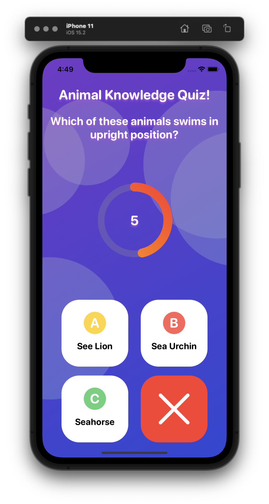

# SwiftUI MVVM AKQuiz
A very short course or tutorial about using MVVM in SwiftUI. You can see the course here: https://www.udemy.com/course/swiftui-quizapp-with-mvvm

### Preview
&nbsp;
&nbsp;
&nbsp;
&nbsp;
